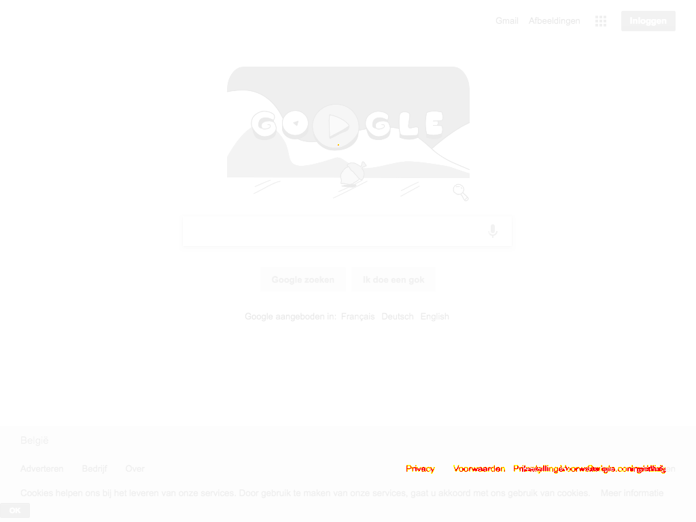

# Automatic visual diffing with Puppeteer

Demo code on how to compare a production and staging website. The code uses Google.com for production and Google.be for staging.

Inspired from https://meowni.ca/posts/2017-puppeteer-tests/#the-thing-that-does-the-diffing

## Installation

    yarn install

## Run

    ./node_modules/mocha/bin/mocha --timeout 10000
